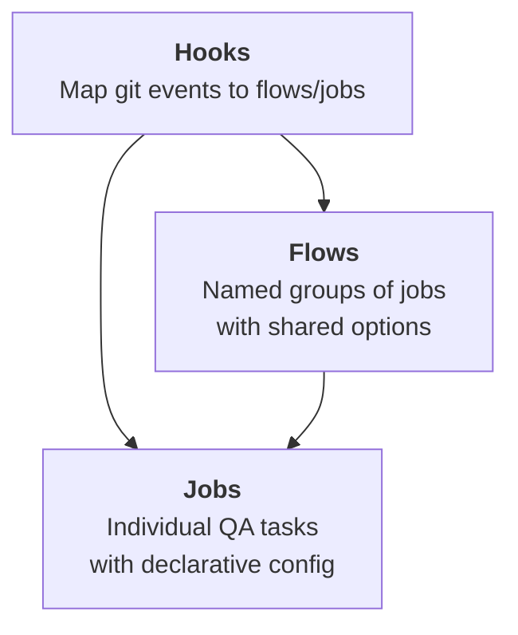

# Configuration

GitHooks uses a PHP configuration file (`githooks.php`) that returns an array with three sections: **hooks**, **flows**, and **jobs**.



## Structure

```php
<?php
return [
    'hooks' => [
        'pre-commit' => ['lint', 'test'],
    ],

    'flows' => [
        'options' => ['fail-fast' => false, 'processes' => 2],
        'lint'    => ['jobs' => ['phpcs_src', 'phpmd_src']],
        'test'    => ['jobs' => ['phpunit_all']],
    ],

    'jobs' => [
        'phpcs_src' => [
            'type'     => 'phpcs',
            'paths'    => ['src'],
            'standard' => 'PSR12',
        ],
        'phpmd_src' => [
            'type'  => 'phpmd',
            'paths' => ['src'],
            'rules' => 'cleancode,codesize,naming',
        ],
        'phpunit_all' => [
            'type'   => 'phpunit',
            'config' => 'phpunit.xml',
        ],
    ],
];
```

## How it fits together

1. **Git fires an event** (e.g. `pre-commit`).
2. **Hooks** resolve the event to one or more flows and/or jobs, applying conditions (branch filters, file patterns).
3. **Flows** execute their jobs with shared options (parallel processes, fail-fast).
4. **Jobs** build and run the shell command for each QA tool.

## Sections

| Section | Required | Description |
|---|---|---|
| [Hooks](hooks.md) | No | Maps git events to flows/jobs. Supports conditional execution by branch and staged files. |
| [Flows](flows.md) | Yes | Named groups of jobs with shared execution options. |
| [Jobs](jobs.md) | Yes | Individual QA tasks with type-specific configuration. Supports inheritance via `extends`. |
| [Options](options.md) | No | Global and per-flow execution options (processes, fail-fast, main-branch). |
| [Configuration File](file.md) | — | File format, search paths, validation, and migration. |

## See also

- [Execution Modes](../execution-modes.md) — full, fast, and fast-branch analysis modes.
- [Tools Reference](../tools/index.md) — all keywords for each QA tool type.
