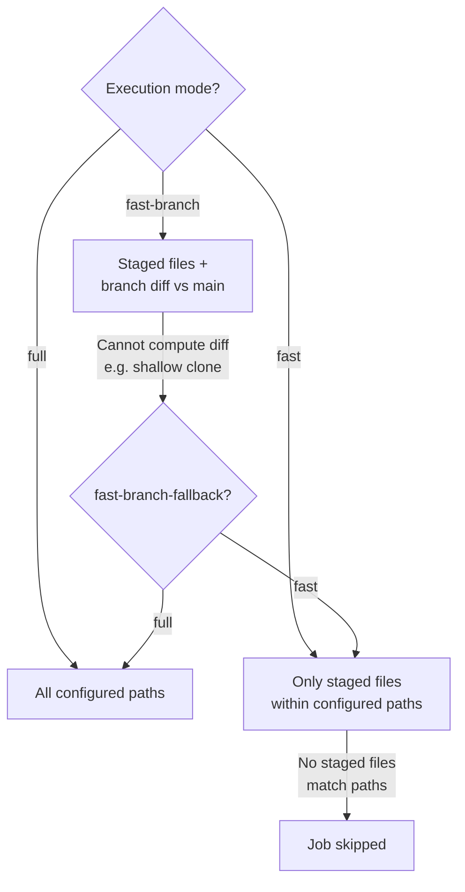

# Execution Modes

GitHooks supports three execution modes that control which files accelerable jobs analyze.

## Modes

| Mode | CLI flag | Behavior |
|---|---|---|
| **full** | *(default)* | Analyze all configured paths. Safe and complete. |
| **fast** | `--fast` | Analyze only staged files within configured paths. Ideal for pre-commit hooks. |
| **fast-branch** | `--fast-branch` | Analyze files that differ between the current branch and the main branch (staged + branch diff). Ideal for CI/CD and pre-push. |



## Which jobs are accelerable?

When running with `--fast` or `--fast-branch`, GitHooks replaces the `paths` of accelerable jobs with only the relevant files. Jobs with no matching files are **skipped entirely**.

| Type | Accelerable by default | Reason |
|---|---|---|
| phpstan, phpcs, phpcbf, phpmd, parallel-lint, psalm | **Yes** | Analyze individual source files |
| phpunit, phpcpd | **No** | phpunit runs tests (not source), phpcpd needs the full codebase for duplication detection |
| custom | **No** | Opt-in via `accelerable: true` in structured mode |

You can override the default for any job:

```php
// Disable acceleration for a specific phpstan job
'phpstan_full' => [
    'type'        => 'phpstan',
    'paths'       => ['src'],
    'accelerable' => false,  // always analyzes full paths, even with --fast
],

// Enable acceleration for a custom job
'eslint_src' => [
    'type'           => 'custom',
    'executablePath' => 'npx eslint',
    'paths'          => ['resources/js'],
    'accelerable'    => true,  // opt-in for --fast path filtering
],
```

Deleted files (staged with `git rm`) are automatically excluded — no tool receives a path to a file that no longer exists.

## Where to set the mode

The mode can be set at multiple levels, from lowest to highest priority:

1. **Default** — `full`.
2. **Per-hook-ref config** — `execution` key in hook refs.
3. **Per-job config** — `execution` key in job definition.
4. **CLI flag** — `--fast`, `--fast-branch` applies to all jobs in the invocation.

This allows mixing modes within the same flow:

```php
'jobs' => [
    // Always runs against all files, even during --fast pre-commit
    'phpstan_src' => [
        'type'      => 'phpstan',
        'paths'     => ['src'],
        'execution' => 'full',
    ],
    // Follows the invocation mode
    'phpcs_src' => [
        'type'     => 'phpcs',
        'paths'    => ['src'],
        'standard' => 'PSR12',
    ],
],
```

Hook refs can also specify a mode:

```php
'hooks' => [
    'pre-commit' => [
        ['flow' => 'qa', 'execution' => 'fast'],          // staged files only
    ],
    'pre-push' => [
        ['flow' => 'qa', 'execution' => 'fast-branch'],   // branch diff
    ],
],
```

!!! info
    For `pre-commit` events, fast mode is activated automatically. You don't need to specify `'execution' => 'fast'`.

## Fast-branch fallback

When `--fast-branch` cannot compute the diff (e.g. in a shallow clone or detached HEAD), the `fast-branch-fallback` option determines the behavior:

| Value | Behavior |
|---|---|
| `'full'` (default) | Falls back to analyzing all configured paths. |
| `'fast'` | Falls back to analyzing only staged files. |

```php
'flows' => [
    'options' => [
        'main-branch'          => 'main',   // auto-detected if omitted
        'fast-branch-fallback' => 'fast',   // fall back to staged files
    ],
],
```
