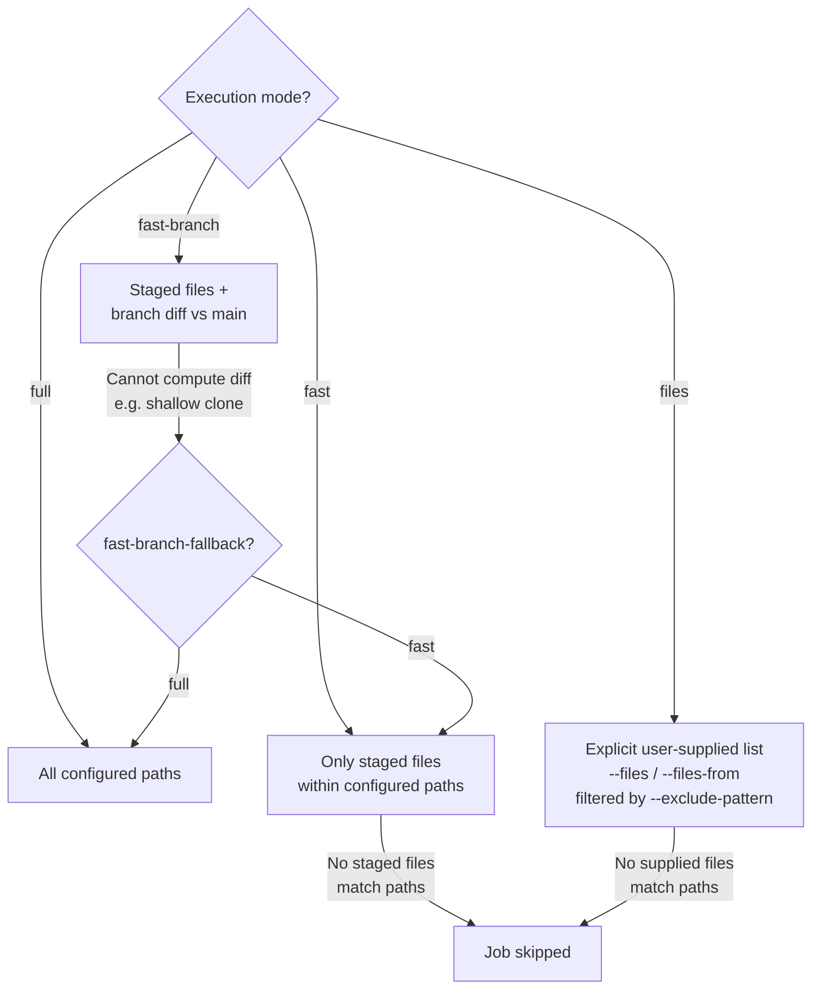

# Execution Modes

GitHooks supports four execution modes that control which files accelerable jobs analyze.

## Modes

| Mode | CLI flag | Behavior |
|---|---|---|
| **full** | *(default)* | Analyze all configured paths. Safe and complete. |
| **fast** | `--fast` | Analyze only staged files within configured paths. Ideal for pre-commit hooks. |
| **fast-branch** | `--fast-branch` | Analyze files that differ between the current branch and the main branch (staged + branch diff). Ideal for CI/CD and pre-push. |
| **files** | `--files` / `--files-from` | Analyze an **explicit list of files** supplied by the operator (or a manifest written to disk). Ideal for IDE on-save, shallow CIs, and external tools that already produced a path list. See [How-To: --files / --files-from](how-to/files-flag.md). |



## Which jobs are accelerable?

When running with `--fast`, `--fast-branch` or `--files` / `--files-from`, GitHooks replaces the `paths` of accelerable jobs with only the relevant files. Jobs with no matching files are **skipped entirely** (with reason `"no input files match its paths"` in files mode). Non-accelerable jobs (phpunit, phpcpd, composer-*, script) ignore the file list and run with their original `paths`.

| Type | Accelerable by default | Reason |
|---|---|---|
| phpstan, phpcs, phpcbf, phpmd, parallel-lint, psalm | **Yes** | Analyze individual source files |
| phpunit, phpcpd | **No** | phpunit runs tests (not source), phpcpd needs the full codebase for duplication detection |
| custom | **No** | Opt-in via `accelerable: true` in structured mode |

You can override the default for any job:

```php
// Disable acceleration for a specific phpstan job
'phpstan_full' => [
    'type'        => 'phpstan',
    'paths'       => ['src'],
    'accelerable' => false,  // always analyzes full paths, even with --fast
],

// Enable acceleration for a custom job
'eslint_src' => [
    'type'             => 'custom',
    'executable-path'  => 'npx eslint',
    'paths'            => ['resources/js'],
    'accelerable'      => true,  // opt-in for --fast path filtering
],
```

Deleted files (staged with `git rm`) are automatically excluded — no tool receives a path to a file that no longer exists.

## Where to set the mode

The mode can be set at multiple levels, from lowest to highest priority:

1. **Default** — `full`.
2. **Per-hook-ref config** — `execution` key in hook refs.
3. **Per-job config** — `execution` key in job definition.
4. **CLI flag** — `--fast`, `--fast-branch` applies to all jobs in the invocation.
5. **Files mode** (`--files` / `--files-from`) — CLI-only; wins over `--fast` / `--fast-branch` (a stderr warning is emitted when mixed). The two file flags are mutually exclusive between themselves. `--exclude-pattern` requires one of them.

This allows mixing modes within the same flow:

```php
'jobs' => [
    // Always runs against all files, even during --fast pre-commit
    'phpstan_src' => [
        'type'      => 'phpstan',
        'paths'     => ['src'],
        'execution' => 'full',
    ],
    // Follows the invocation mode
    'phpcs_src' => [
        'type'     => 'phpcs',
        'paths'    => ['src'],
        'standard' => 'PSR12',
    ],
],
```

Hook refs can also specify a mode:

```php
'hooks' => [
    'pre-commit' => [
        ['flow' => 'qa', 'execution' => 'fast'],          // staged files only
    ],
    'pre-push' => [
        ['flow' => 'qa', 'execution' => 'fast-branch'],   // branch diff
    ],
],
```

!!! info
    For `pre-commit` events, fast mode is activated automatically. You don't need to specify `'execution' => 'fast'`.

## Fast-branch fallback

When `--fast-branch` cannot compute the diff (e.g. in a shallow clone or detached HEAD), the `fast-branch-fallback` option determines the behavior:

| Value | Behavior |
|---|---|
| `'full'` (default) | Falls back to analyzing all configured paths. |
| `'fast'` | Falls back to analyzing only staged files. |

```php
'flows' => [
    'options' => [
        'main-branch'          => 'main',   // auto-detected if omitted
        'fast-branch-fallback' => 'fast',   // fall back to staged files
    ],
],
```

## Files mode (`--files` / `--files-from`)

When the input is an **explicit user-supplied list of files** (IDE on-save, manifests piped from `git diff`, shallow CIs where `--fast-branch` cannot compute a diff), use the `--files` flags instead of relying on git state.

```bash
# Single file — typical IDE on-save call
githooks flow qa --files=src/Foo.php

# Several files at once
githooks flow qa --files=src/Foo.php,src/Bar.php

# Manifest produced by an external tool
git diff --name-only origin/main...HEAD > /tmp/changed.txt
githooks flow qa --files-from=/tmp/changed.txt

# Manifest minus tests and generated code
githooks flow qa --files-from=/tmp/changed.txt \
                 --exclude-pattern='tests/**,**/Generated/**'
```

- **`--files=a,b,c`** — CSV. Paths resolve against CWD; absolute paths accepted as-is. Directories expand recursively to `.php` / `.phtml`.
- **`--files-from=PATH`** — manifest with one path per line. Tolerates comments (`#`), blanks, CRLF and UTF-8 BOM. Use it to bypass shell `ARG_MAX` limits.
- **`--exclude-pattern=glob1,glob2`** — drop matching paths from the input list (post-expansion). Same glob syntax as hook config (`*`, `**`, `?`).

`--files` and `--files-from` are mutually exclusive. Mixing files mode with `--fast` / `--fast-branch` emits a stderr warning and files mode wins. `conf:check` rejects `files` / `files-from` declared in `flow.options` or in a job — they are CLI-only by design (volatile per invocation).

When files mode is active, JSON v2 sets `executionMode: "files"` and adds a root `inputFiles` block plus a per-job `inputFiles` slice on accelerable jobs. See [How-To: --files / --files-from](how-to/files-flag.md) for the full reference and [Output formats: Input files block](how-to/output-formats.md#input-files-block) for the JSON shape.
