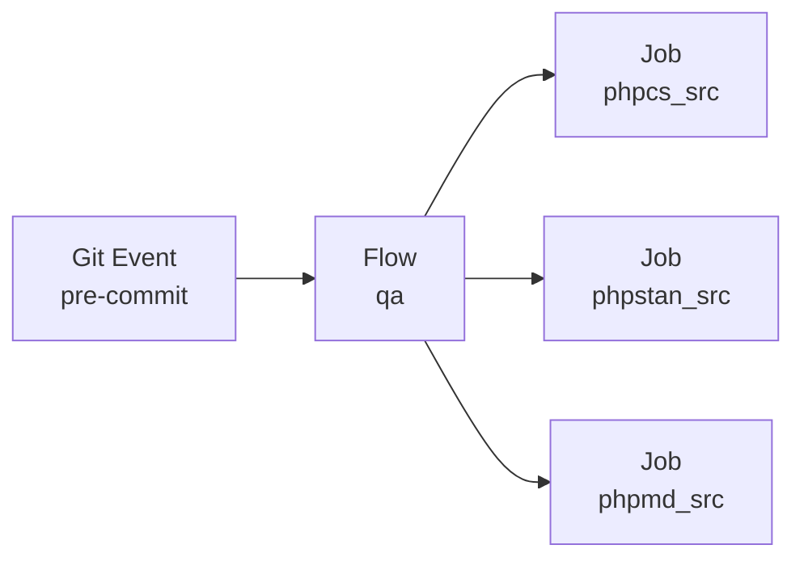

# Your First Config

GitHooks uses a single PHP file (`githooks.php`) to configure all QA tools, hooks, and execution options.

## Generate the configuration

```bash
githooks conf:init
```

In interactive mode, `conf:init`:

1. **Detects** QA tools already installed in `vendor/bin/` (phpstan, phpcs, phpmd, etc.).
2. **Asks** which tools to include.
3. **Asks** for source directories (comma-separated, default `src`).
4. **Asks** which hook events to configure (`pre-commit`, `pre-push`, both, or none).
5. **Generates** a tailored `githooks.php`.

!!! tip "Non-interactive mode"
    Use `githooks conf:init -n` to copy a template file with examples of all supported job types. Useful for CI environments or if you prefer editing manually.

## Anatomy of the configuration

The generated file returns a PHP array with three sections:

```php
<?php
return [
    'hooks' => [ ... ],   // Map git events to flows/jobs
    'flows' => [ ... ],   // Named groups of jobs with shared options
    'jobs'  => [ ... ],   // Individual QA tasks
];
```



- **Hooks** map git events (`pre-commit`, `pre-push`, etc.) to flows and/or jobs.
- **Flows** are named groups of jobs with shared options like `fail-fast` and `processes`.
- **Jobs** are individual QA tasks. Each declares a `type` (e.g. `phpstan`, `phpcs`) and its configuration.

See the [Configuration reference](../configuration/index.md) for the full keyword documentation.

## File location

GitHooks searches for the configuration file in this order:

1. `./githooks.php`
2. `./qa/githooks.php`

You can also specify a custom path with `--config=path/to/githooks.php` on any command.

## Validate the configuration

```bash
githooks conf:check
```

This verifies the structure, checks that referenced executables and paths exist, and reports errors and warnings.

## Next step

[Install your first hook :material-arrow-right:](first-hook.md)
